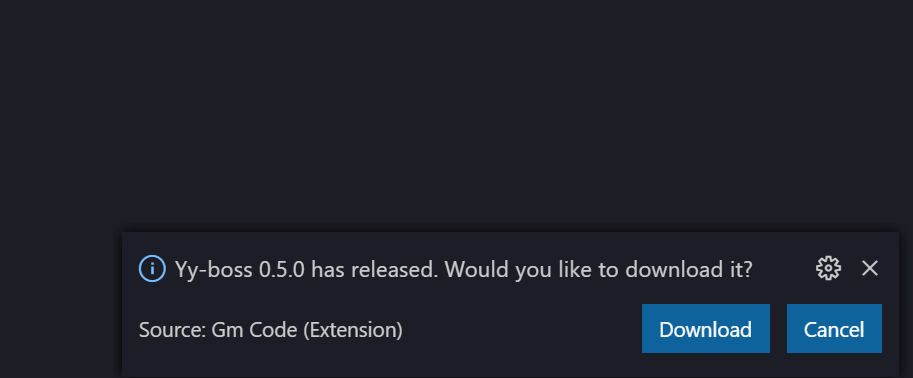
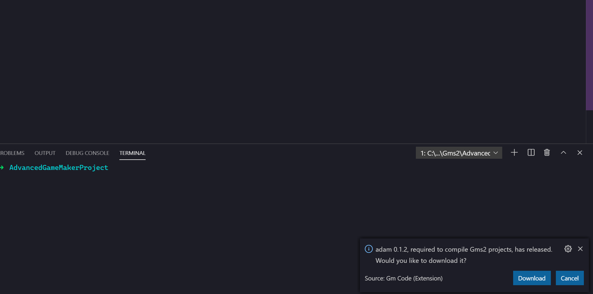
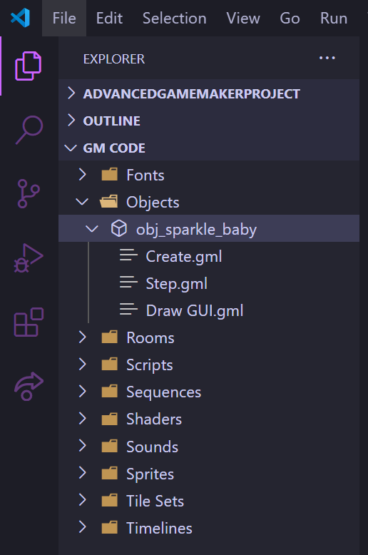

# Getting Started

Hello there! This is a *user* guide, not a contribution guide. That guide will be made shortly!

To use this extension, please download Visual Studio Code [here](https://code.visualstudio.com/) and then download Gm [Code here](https://marketplace.visualstudio.com/items?itemName=sanbox.gm-code-vsc).

## Downloading the Backend and Adam

Once you've got it all downloaded, look at the left side at the "Explorer" panel, right here:
  

Make sure that "GM CODE" tab is expanded and visible. Feels free to collapse the others, including the normal file explorer -- in this tree, we'll be showing you the Gms2 Asset Browser. This tab might be empty for now.

Look in the bottom right hand corner, and you'll see a popup like this:
  

Make sure to hit "Download". Without it, the extension can't run! You're downloading the backend server that gm-code-vsc relies on.

Afterwards, you'll *probably* get another popup like this:
  

This is for *adam*, which we use to compile Gms2 projects. If all you do is simple compiles (no YYC, no configuration besides the default), then hitting Download to this is *just fine*. However, if you want more control, please consider looking at the [adam repository here](https://github.com/NPC-Studio/adam), and invoking adam by adding it to your PATH (if you're a Windows user, using Scoop is a great idea!), rather than doing it entirely through this extension.

Okay, once you've gotten through those steps, you're good to go!

## Navigating the Asset Tree

After you've hit okay to the above, you should see a lovely asset browser on the left, like so:
  

And now, to use the extension, simple left click text files to open them, or right click files to access more context specific options. For example, to add a new event to an object, simply right click an object to summon up this menu:
  

The asset tree isn't kept up to date automatically (this might change in the future) -- this might matter if you make changes with Git, or make changes outside of VSCode. To refresh the Asset Browser, simply hit the little "refresh" button at the top of the menu, right here:
  

Restarting the server can sometimes be a little buggy. We're always working to iron out bugs, so if you run into problems, please submit a bug report!

## Compiling a Project
